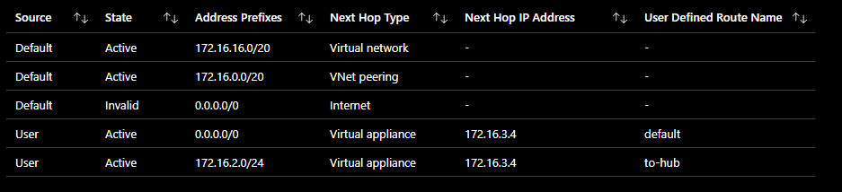

# Demo Bastion test

Demo to demonstrate Azure Bastion functionalities

## Deployed Architecture

Following diagram was deployed during testing :

## Components

The solution contained following components :

### vNets

Two virtual networks are created :

- demo-hub : 172.16.0.0/20 acting as the hub network
- demo-spoke : 172.16.16.0/20 acting as the spoke network

Peering was activated between both vNets and traffic to/from the remote vNets is allowed.

### Azure Bastion

A standard Azure Bastion Host was provisioned with copy/paste, ip-based connections and native client support features.

The bastion host was deployed in a dedicated subnet "AzureBastionSubnet" (required naming convention) and has no route tables associated with it (is also a Azure mandatory requirement).

Azure bastion learns it routes via (and will not pass the Azure Firewall) :

- local vnet : 172.16.0.0/20
- peered vnets : 172.16.16.0/20
- on-premise networks (not part of the demo) : via virtal network gateway propagation

If other routes should also be known or injectected, it is possible to use an Azure Route Server to allow nva's to propogate their bgp routes if so required. This should normally not be required in our case.

Depending on the mechanism used you will need to provide the correct rigths on the resources :

- ip based connection : reader rights on the bastion resource
- portal based connections to vm's in the hub network : reader rights on the bastion resource, vm node and vm nic
- portal based connections to vm's in the peered network : reader rights on the bastion resource, peered vnet, vm node and vm nic

### Azure Firewall

A standard Azure Firewall was used to protect hub-spoke connection (bastion communication excluded).

The Azure Firewall was deployed in a dedicated subnet "AzureFirewallSubnet" (required naming convention) and has no specifice route table associated with it (no need for it in this proof-of-concept scenario).

One firewall rulle was applied to allow all traffic from subnets 172.16.2.0/24 (hub node) and 172.16.17.0/24 (spoke node).

### Hub Node

A virtual machine was provisioned in a dedicated subnet in the Hub vNet.

A user defined routing table was associated with two routes :

- default route : 0.0.0.0/24 next hop Azure Firewall
- spoke route : 172.16.17.0/24 next hop Azure Firewall (required to overide the injected route created by the vNet Peering)

Following communication results apply :

- ping to 172.16.17.4 (spokenode) : success (allowed by rule in Azure Firewall)
- ping to 172.16.18.4 (standalone node) : failure (does not pass Azure Firewall but is protected by nsg rule)
- curl [http://www.google.be](http://www.google.be) (internet access) : success (allowed by rule in Azure Firewall)

Bastion can reach this node because local subnets are automatically injected in the nic routing table.

Return traffic does not pass the Azure Firewall because the node will use it's own injected route of it's local vnet (this supersedes the default route in the routing table). Same principle applies voor the spoke node (see screenshot effective routes).

It is important to not include a route in the routing table that includes the private ip range from the basion subnet. This should not be a problem for the hub subnets, but needs attention for routing tables in the spoke networks.

### Spoke Node

A virtual machine was provisioned in a dedicated subnet (spokevm-subnet) in the Spoke vNet.

A user defined routing table was associated with two routes :

- default route : 0.0.0.0/24 next hop Azure Firewall
- spoke route : 172.16.2.0/24 next hop Azure Firewall (required to overide the injected route created by the vNet Peering)

Following communication results apply :

- ping to 172.16.2.4 (hubnode) : success (allowed by rule in Azure Firewall)
- ping to 172.16.18.4 (standalone node) : failure (does not pass Azure Firewall but is protected by nsg rule)
- curl [http://www.google.be](http://www.google.be) (internet access) : success (allowed by rule in Azure Firewall)

Bastion can reach this node because it knows the route due to route injection during vnet peering

Return traffic does not pass the Azure Firewall because the node will use it's own injected route of the remote vnet (this supersedes the default route in the routing table). Below you can find an overview of the effective routes for this Virtual machine :

The default internet route is invalid since the vm does not have a public ip associated with it.

It is important to not include a route in the routing table that includes the private ip range from the basion subnet. This is important since spoke networks will use the subnets in the hub in their routing tabel (in order to force Azure Firewall passthru). This can be achieved in serveral ways :

- use restrictive routing scopes that do not include the private ip range of the bastion subnet (this mechanism was used in this demo)
- Devide the hub vnet in different blocks (for instance 172.16.0.0/21 and 172.16.8.0/21). Both make up the entire range of 172.16.0.0/20.
  - Deploy normal vm's in the first block
  - Deploy the Bastion in the second block
  - Use 172.16.0.0/21 as route scope for the Firewall
- Assign a secondary range to the Hub vNet and deploy the bastion in this secondary range (do not use this range in the route tables)
- Use Azure route server to control witch routes are propagated to the different subnets

To be clear : if we would have used a route of 172.16.0.0/20 in the spoke route table, this would have broken the return path for Bastion.

### Standalone Node

A virtual machine was provisioned in a dedicated subnet (standalone-subnet) in the Spoke vNet. No user defined routing table was associated with this subnet (to demonstrate the route injection mechanisms)

A Nsg rule is applied to the virtual machine network interface with following rules :

- Allow all traffic from 172.16.1.0/24 (Bastion subnet)
- deny all other traffic

Following communication results apply :

- ping to 172.16.2.4 (hubnode) : success (does not pass Azure Firewall, route is known by default route injection).
- ping to 172.16.17.4 (spokenode) : succes (does not pass Azure Firewall, route is known by default route injection).
- curl [http://www.google.be](http://www.google.be) (internet access) : success (does not pass Azure Firewall, will route through it's own public ip)

Bastion can reach this node because it knows the route due to route injection during vnet peering (and traffic is allowed by the nsg rule).

Return traffic does not pass the Azure Firewall because the node will use it's own injected route of the remote vnet (this supersed the default route in the routing table). Below you can find an overview of the effective routes for this Virtual machine :

The default internet route is valid since it has a public ip associated with it.

Default Azure routes (and present vnets) are also injected (some do not have a next hop due to no peering or not provisioned services)
